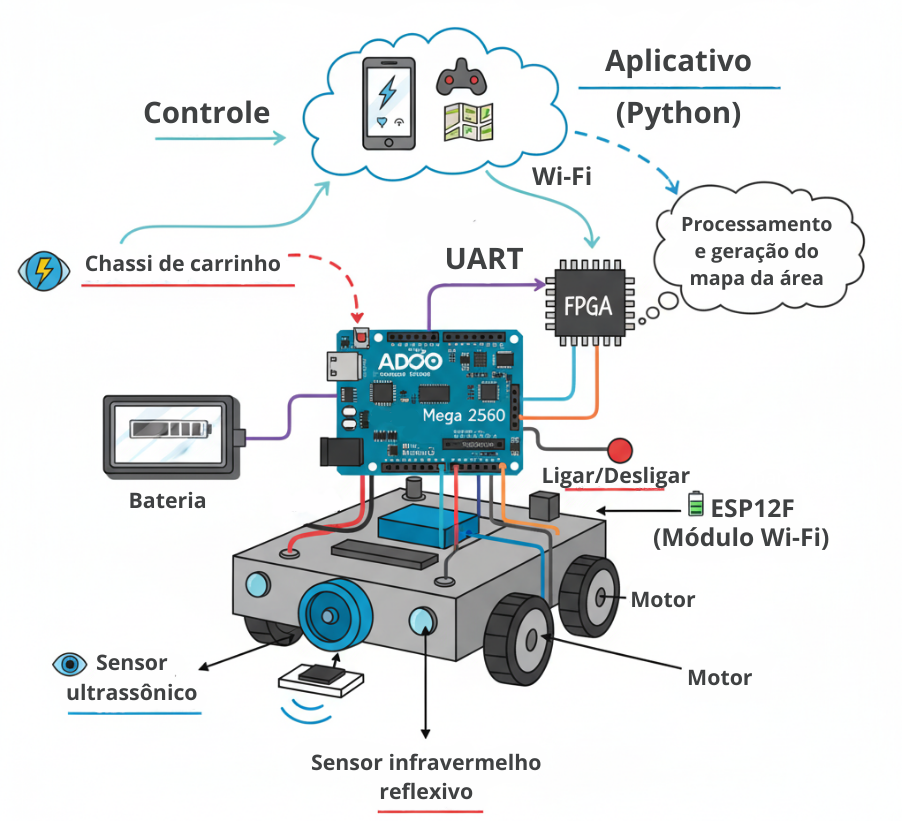

# Descrição do Projeto:

O projeto consiste em um robô aspirador do tipo *bump-and-go*, com detecção de colisão e queda, sucção simples e controle remoto via aplicativo móvel.

O robô utilizará sensores ultrassônicos para calcular distâncias e prever colisões, realizando desvios em ângulos definidos pelo usuário. Para o controle do ângulo de locomoção, serão empregados giroscópios e o sensor MPU-6050. 

Além disso, o robô coletará dados de deslocamento (possivelmente com auxílio de GPS) para criar um mapa das áreas já percorridas, facilitando a navegação e evitando repetições desnecessárias da limpeza. 

Por meio de um aplicativo desenvolvido em Python e conectado via Bluetooth, o usuário poderá configurar parâmetros como ângulo de giro, distância mínima para desvio e outros ajustes de navegação. O aplicativo também permitirá acompanhar em tempo real a área percorrida, o nível da bateria e o progresso do mapeamento. 

Um FPGA será utilizado para o processamento dos dados enviados pelo robô e para a geração das análises necessárias ao funcionamento do sistema.

Link para o documento de planejamento: https://www.overleaf.com/read/wmhgfznhyjgz#2d5a3a

# Rich Picture

