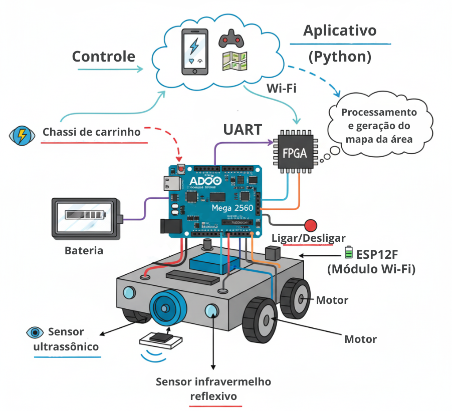

# Descrição do Projeto:

O projeto consiste em um robô aspirador do tipo *bump-and-go*, com detecção de colisão e queda, sucção simples e controle remoto via aplicativo móvel.

O robô utilizará sensores ultrassônicos para calcular distâncias e prever colisões, realizando desvios em ângulos definidos pelo usuário. Para o controle do ângulo de locomoção, serão empregados giroscópios e o sensor MPU-6050. 

Além disso, o robô coletará dados de deslocamento (possivelmente com auxílio de GPS) para criar um mapa das áreas já percorridas, facilitando a navegação e evitando repetições desnecessárias da limpeza. 

Por meio de um aplicativo desenvolvido em Python e conectado via Bluetooth, o usuário poderá configurar parâmetros como ângulo de giro, distância mínima para desvio e outros ajustes de navegação. O aplicativo também permitirá acompanhar em tempo real a área percorrida, o nível da bateria e o progresso do mapeamento. 

Um FPGA será utilizado para o processamento dos dados enviados pelo robô e para a geração das análises necessárias ao funcionamento do sistema.

Link para o documento de planejamento: https://www.overleaf.com/read/wmhgfznhyjgz#2d5a3a

# Rich Picture

# Organização das Pastas

## App

Executável do app para comunicação com o carrinho e código-fonte. A comunicação é realizada via Bluetooth, ajustada para funcionar exclusivamente com o endereço MAC do ESP utilizado no projeto.

## ESP

Códigos-fonte para uso no ESP, divididos em:

* **ESPMain.ino**: Funções `void` e `setup` para comunicação.
* **OTHERS.CPP/H**: Utilitários para uso nas demais funções.
* **toApp.cpp/h**: Comunicação Bluetooth com o app.
* **toArduino.cpp/h**: Comunicação serial UART com o Arduino.
* **toFPGA.cpp/h**: Comunicação Wi-Fi com o FPGA (atualmente, conecta-se com o PC apenas para validação).

## Arduino

* **Main.ino**: Funções `setup` e `void` para inicialização dos sensores e comunicação.
* **espComunicacao.cpp/h**: Comunicação com o ESP via UART.
* **motores.cpp/h**: Controle dos motores através da ponte H e agrupamento das funções para controle dos sensores.
* **mpu.cpp/h**: Controle do MPU para ajuste de ângulo de rotação.
* **outros.cpp/h**: Funções auxiliares.
* **ultrassonico.cpp/h**: Controle dos três ultrassônicos para medição de distância.

## FPGA

* **Hardware**: Implementação em Verilog do trecho escolhido.
* **Software**: Software inicial sem hardware.
* **SWparaRodarFingindoSerOFPGA**: Software adaptado para simulação do FPGA.
* **quartus.zip**: Projeto Quartus integrado e funcional com o acelerador.
